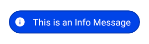

# AwesomeToast Android Library


Simple library for managing awesome custom toast in Android SDK


**Status:** Document in progress..

## Abstract
    Awesome Toast is a simple and easy to use Toast library for Android. 
    The library provides some common toast message (Default, Success, Error, Warning, and Information), 
    but also you can create your own Toast message using the methods describe below. 
    You can use it to enhance the user experience and save developing time. Cheers!

Setup
-----

**Gradle** 

  -  Step 1. Add the the JitPack repository to your project level `build.gradle`:
 
```gradle
allprojects {
	repositories {
		maven { url "https://jitpack.io" }
	}
}
```
  -  Step 2. Add this dependency to your app `build.gradle`:
 
```gradle
dependencies {
	implementation 'com.github.miguelfagundez:AwesomeToast-Android:1.0.1'
}
```

Usage
-----

**MainActivity.java** 

```java
// Common toast available into the library
AwesomeToast.infoGradient(this, " Awesome Toast! "); // Just one line 
```

```java
// Custom Toast
new AwesomeToast.Create(this, " Awesome Toast! ") // Create a new AwesomeToast, you need context and message
        .setImageValue(R.drawable.ic_clock_logo)  // You can (or cannot include an image)
        .setIsGradient(true)			  // Linear gradient (Top to Bottom) available
        .setTextBold(true)			  // Bold style available
        .setAllRadius(25)			  // Corner radius (recommended between 25 to 75)
        .setTextSize(Constants.TEXT_BIG_SIZE)	  // Text Size (options available SMALL, NORMAL, BIG, or DEFAULT)
        .setToastGravity(Constants.TOAST_CENTER_POSITION)  // Toast Gravity (BOTTOM, CENTER, or TOP)
        .show();				           // ALWAYS include .show method at the end.
```

**Toast Messages Available into the Library**

The library has some common Toast available just in one line. Each type has four options (Normal, Peak, Gradient, and PeakGradient). The table below shows a complete example with its pictures.

| Toast Name | Picture |
| ------------- | ------------- |
| `AwesomeToast.info(this, " This is an Info Message ");` | </img>  |
`AwesomeToast.infoPeak(this, " This is an Info Message (Peak) ");` | </img>  |
`AwesomeToast.infoGradient(this, " This is an Info Message (Gradient) ");` | </img>  |
`AwesomeToast.infoGradientPeak(this, " This is an Info Message (Both) ");` | </img>  |

Success, error, and warning follow the same patterns. For example, Success:

     AwesomeToast.success(this, " This is an Success Message ");
     AwesomeToast.successPeak(this, " This is an Success Message (Peak) ");
     AwesomeToast.successGradient(this, " This is an Success Message (Gradient) ");
     AwesomeToast.successGradientPeak(this, " This is an Success Message (Both) ");

For defaults are only available normal and peak options. For example:

Default White: `AwesomeToast.defaultWhite(this, " This is a Message ");`

Default White Peak: `AwesomeToast.defaultWhitePeak(this, " This is a Message ");`

Default Black: `AwesomeToast.defaultBlack(this, " This is a Message ");`

Default Black Peak: `AwesomeToast.defaultBlackPeak(this, " This is a Message ");`


Attributes
-----

|Attribute name|Type|Default value|Description|
|---|---|:---:|---|
|text|String|N/A|text shows in Toast|
|textColor|int|White|Text color|
|textSize|int|TEXT_NORMAL_SIZE = 16sp| Text Size|
|textBold|boolean|false|Text bold available|
|shape|int|RECTANGLE|Toast shape is a rectangle|
|imageValue|int|0|Image in Toast (optional)|
|backgroundColor|int|Grey|Background color in Toast (plain option only)|
|borderColor|int|Black|Border color in Toast (plain or gradient option)|
|borderWidth|int|8|Border size in Toast|
|toastGravity|int|TOAST_BOTTOM_POSITION|Toast position in Screen (TOP and CENTER available)|
|toastLength|int|Toast.LENGTH_SHORT|Toast duration (LENGHT_LONG available)|
|isGradient|boolean|false|Background color in gradient mode|
|gradientColorStart|int|Black|Start gradient color (Top) / isGradiente MUST be TRUE|
|gradientColorEnd|int|Grey|End gradient color (Bottom) / isGradiente MUST be TRUE|
|radiusTopLeft|int|0|Top left corner|
|radiusBottomLeft|int|0|Bottom left corner|
|radiusTopRight|int|0|Top right corner|
|radiusBottomRight|int|0|Bottom right corner|

Colors
-----

The library has two main toast color options: plain and gradient. By default, gradient option is not available. If you want to use the gradient option then you **MUST** include these three methods in your custom toast:

```java
// Custom Toast
new AwesomeToast.Create(this, " Gradient actived! ") // Create a new AwesomeToast, you need context and message
	...
	.setIsGradient(true)			     // Taking gradient option as default
        .setGradientColorStart( YOUR INITIAL COLOR ) // Set your initial color here 
        .setGradientColorEnd( YOUR END COLOR )	     // Set your end color here
        ...
        .show();				     // ALWAYS include .show method at the end.
```

You can define your own colors into `res/values/colors.xml` folder. Then you can apply them using `this.getResources().getColor(R.color.YOUR_COLOR_NAME)`. These same principles apply for Background Color, Border Color, and Text Color. By default, the colors used into the library are:

|Color name|Hexa value|Used|
|---|---|---|
|Black|#000000|Background and Text|
|Grey|#7E7E7E|Background and Text|
|White|#FFFFFF|Background and Text|
|Green Light|#17BF0B|Success background plain/gradient|
|Green Dark|#0F8A07|Success border and gradient|
|Red|#E80E0E|Error background plain/gradient|
|Red Dark|#B60D0D|Error border and gradient|
|Blue Light|#0E45E8|Info background plain/gradient|
|Blue Dark|#0C38BA|Info border and gradient|
|Orange Light|#E89F0E|Warning background plain/gradient|
|Orange Dark|#BC810C|Warning border and gradient|

If you want to include your own colors (gradient, plain, background, border, or any other color options), then you need to do as follow:

```java
// Custom Toast
new AwesomeToast.Create(this, " Your colors! ") // Create a new AwesomeToast, you need context and message
	...
	.setIsGradient(true)			                                      // Taking gradient option as default
        .setGradientColorStart(this.getResources().getColor(R.color.YOUR_COLOR_NAME)) // Set your initial color here 
        .setGradientColorEnd(this.getResources().getColor(R.color.YOUR_COLOR_NAME))   // Set your end color here
        ...
        .show();				     // ALWAYS include .show method at the end.
```

Text Size
-----

The library manages only 4 different text sizes: 12sp, 16sp, 20sp, and 24sp.

|Const name|Value|Description|
|---|---|---|
|Constants.TEXT_SMALL_SIZE|12sp|Optional|
|Constants.TEXT_NORMAL_SIZE|16sp|Default value|
|Constants.TEXT_BIG_SIZE|24sp|Optional|
|No name|20sp|If you include any other different value|

If you want to change the text size you can apply the custom toast as follow:

```java
// Custom Toast
new AwesomeToast.Create(this, " Text Size is Big! ") // Create a new AwesomeToast, you need context and message
	...
	.setTextSize(Constants.TEXT_BIG_SIZE)	     // Changing the text size to 24sp (BIG)
        ...
        .show();				     // ALWAYS include .show method at the end.
```

Images
-----

The library manages only one image per toast in the left side. This is optional, so you can include it if neccessary. I recommend to use a vector asset which size is between 24dp and 48dp. By default, the toast available in the library use an image size of 24dp. If you want to include an image, then you must use the `.setImageValue()` method as follow:

```java
// Custom Toast
new AwesomeToast.Create(this, " Toast with image! ") // Create a new AwesomeToast, you need context and message
	...
	.setImageValue(R.drawable.YOUR_IMAGE_NAME)   // Show an image in the toast (Optional)
        ...
        .show();				     // ALWAYS include .show method at the end.
```


Toast corners
-----

You can create a toast with different round corners radius. You can modify each corner independently or all in one method, see example for details:

```java
// Custom Toast
new AwesomeToast.Create(this, " Toast all corners! ") // Create a new AwesomeToast, you need context and message
	...
	.setAllRadius(75)   	// Set all corners a radius of 75 each
        ...
        .show();		// ALWAYS include .show method at the end.
```

or you can change each corner separately. You can include all corners or only few of them because by default each corner has 0 as initial value. 

```java
// Custom Toast
new AwesomeToast.Create(this, " Toast each corner! ") // Create a new AwesomeToast, you need context and message
	...
	.setRadiusTopLeft(75)   	// Set Top Left corner a value of 75
	.setRadiusTopRight(50)   	// Set Top Right corner a value of 50
	.setRadiusBottomLeft(25)   	// Set Bottom Left corner a value of 25
	.setRadiusBottomRight(75)   	// Set Bottom Right corner a value of 75
        ...
        .show();		// ALWAYS include .show method at the end.
```

Toast position
-----

By default, toast is presented at the Bottom of the screen. However, you can modify this position using `.setToastGravity()` method as follow:

```java
// Custom Toast
new AwesomeToast.Create(this, " Toast all corners! ") // Create a new AwesomeToast, you need context and message
	...
	.setToastGravity(Constants.TOAST_CENTER_POSITION)   // Set toast at the CENTER of the screen 
	...						    // (BOTTOM, CENTER, and TOP are available)
        .show();					    // ALWAYS include .show method at the end.
```

Options available:

|Const name|Description|
|---|---|
|Constants.TOAST_TOP_POSITION|Optional|
|Constants.TOAST_CENTER_POSITION|Optional|
|Constants.TOAST_BOTTOM_POSITION|Default value|

Toast shape
-----

The library uses the **RECTANGLE** as shape by default. However, you can modify this shape using toast corners above or even using the `.setShape()` method as follow:

```java
// Custom Toast
new AwesomeToast.Create(this, " Toast all corners! ") // Create a new AwesomeToast, you need context and message
	...
	.setShape(GradientDrawable.OVAL)   	// Set a new shape (OVAL) 
	...					  
        .show();				// ALWAYS include .show method at the end.
```

However, the library does not manage any other shape. If you want to change the shape, then you need to use GradientDrawable option as showed above. 


Author
-----

**Miguel Fagundez** - [Miguel's website](https://miguelfagundez.weebly.com/)

## License
The work done has been licensed under MIT License. This means that you can use this library and its code without any restriction. The license file can be found
[here](LICENSE). You can find out more about the license at:

https://opensource.org/licenses/MIT

```
MIT License

Copyright (c) 2020 Miguel Fagundez

Permission is hereby granted, free of charge, to any person obtaining a copy
of this software and associated documentation files (the "Software"), to deal
in the Software without restriction, including without limitation the rights
to use, copy, modify, merge, publish, distribute, sublicense, and/or sell
copies of the Software, and to permit persons to whom the Software is
furnished to do so, subject to the following conditions:

The above copyright notice and this permission notice shall be included in all
copies or substantial portions of the Software.

THE SOFTWARE IS PROVIDED "AS IS", WITHOUT WARRANTY OF ANY KIND, EXPRESS OR
IMPLIED, INCLUDING BUT NOT LIMITED TO THE WARRANTIES OF MERCHANTABILITY,
FITNESS FOR A PARTICULAR PURPOSE AND NONINFRINGEMENT. IN NO EVENT SHALL THE
AUTHORS OR COPYRIGHT HOLDERS BE LIABLE FOR ANY CLAIM, DAMAGES OR OTHER
LIABILITY, WHETHER IN AN ACTION OF CONTRACT, TORT OR OTHERWISE, ARISING FROM,
OUT OF OR IN CONNECTION WITH THE SOFTWARE OR THE USE OR OTHER DEALINGS IN THE
SOFTWARE.
```
